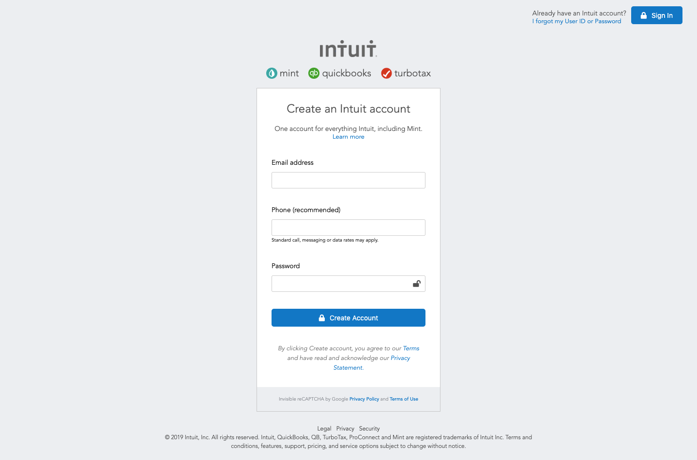

# [forms-project](https://raw.githack.com/rociac/forms-project/development/index.html)



## Table of content
- [Description](#description)
- [Installation](#installation)
- [Contact](#contact)

## Description
Clone of Mint.com sign up form.
This [project](https://raw.githack.com/rociac/forms-project/development/index.html) was made for Microverse using html forms and css and is a clone of the [mint website](https://accounts.intuit.com/signup.html?offering_id=Intuit.ifs.mint&namespace_id=50000026&redirect_url=https%3A%2F%2Fmint.intuit.com%2Foverview.event%3Futm_medium%3Ddirect%26cta%3Dnav_sign_up_dropdown)


## Installation

1. Clone the project to your local directory
```
git clone https://github.com/rociac/forms-project
```
2. Open the index.html file in your browser to view the website in all its glory (Live-server is recommended to view live changes automatically)

## Contact
This template was created in collaboration with Rodolfo and myself
You can contact Rodolfo at:
- [Email](acosta.rodolfo.rca@gmail.com)

You can contact me at:
- [Email](shivamkaushikofficial@gmail.com)
- [Linkedin](https://www.linkedin.com/in/shivam-kaushik-bb8162102/)
- [Twitter](https://twitter.com/kShivamDev)
- [Medium](https://medium.com/@shivamkaushikofficial)


